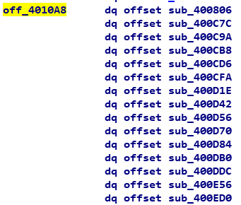

# UNCTF-vm Writeup
从题目中就可以看得出来，这是个虚拟机，对于大部分逆向的初学者来说，看到vm就怕，我看着这个虚拟机比较适合入门，所以就写一篇writeup。

## 1.准备工作
没有后缀名，应该是Linux下程序，我先选择ida pro64打开程序，稍微看下反汇编，有rbp寄存器，表明这程序是64位程序，如果是ebp寄存器的话就是32位程序，找到main函数，
F5反编译，得到程序主逻辑。

<br>

## 2.逆向分析
### main()

代码逻辑比较简单。先给s上的96字节置0,再给v3分配40字节空间。调用sub_400C1E初始化v3上的内容。用s接收32字符，如果不是32长度就失败，如果是，则调用
**v3函数指针所对应的函数，参数分别是v3, &unk_602080, &unk_6020A0, &s，最后的!=0可以猜测这个函数返回值是逻辑型。

### sub_400C1E(__int64 a1)
```c
__int64 __fastcall sub_400C1E(__int64 a1)
{
  __int64 result; // rax

  *(_QWORD *)a1 = off_4010A8;
  *(_QWORD *)(a1 + 8) = 0LL;
  *(_BYTE *)(a1 + 16) = 0; //a
  *(_BYTE *)(a1 + 17) = 0; //b
  *(_BYTE *)(a1 + 18) = 0; //c
  *(_DWORD *)(a1 + 20) = 0; //d
  *(_QWORD *)(a1 + 24) = 0LL; //e
  result = a1;
  *(_QWORD *)(a1 + 32) = 0LL;
  return result;
}
```
不难发现完成是一些值的初始化工作 值得注意的是*(_QWORD *)a1 = off_4010A8;中a1的值被赋off_4010A8。

### off_4010A8

off_4010A8是一个函数指针列表，其中存着大量的函数。所以 **v3调用的即是sub_400806

### sub_400806
这里我重命名参数。
```c
signed __int64 __fastcall sub_400806(__int64 offset, __int64 const_value, __int64 check_code, __int64 input)
{
  *(_QWORD *)(offset + 8) = const_value + 9;
  *(_QWORD *)(offset + 24) = check_code;
  *(_QWORD *)(offset + 32) = input;
  while ( 2 )
  {
    switch ( **(unsigned __int8 **)(offset + 8) )
    {
      case 0xA0u:
        (*(void (__fastcall **)(__int64))(*(_QWORD *)offset + 8LL))(offset);
        continue;
      case 0xA1u:
        (*(void (__fastcall **)(__int64))(*(_QWORD *)offset + 16LL))(offset);
        continue;
      case 0xA2u:
        (*(void (__fastcall **)(__int64))(*(_QWORD *)offset + 0x18LL))(offset);
        *(_QWORD *)(offset + 8) += 11LL;
        continue;
      case 0xA3u:
        (*(void (__fastcall **)(__int64))(*(_QWORD *)offset + 0x20LL))(offset);
        *(_QWORD *)(offset + 8) += 2LL;
        continue;
      case 0xA4u:
        (*(void (__fastcall **)(__int64))(*(_QWORD *)offset + 0x28LL))(offset);
        *(_QWORD *)(offset + 8) += 7LL;
        continue;
      case 0xA5u:
        (*(void (__fastcall **)(__int64))(*(_QWORD *)offset + 0x30LL))(offset);
        ++*(_QWORD *)(offset + 8);
        continue;
      case 0xA6u:
        (*(void (__fastcall **)(__int64))(*(_QWORD *)offset + 0x38LL))(offset);
        *(_QWORD *)(offset + 8) -= 2LL;
        continue;
      case 0xA7u:
        (*(void (__fastcall **)(__int64))(*(_QWORD *)offset + 0x40LL))(offset);
        *(_QWORD *)(offset + 8) += 7LL;
        continue;
      case 0xA8u:
        (*(void (__fastcall **)(__int64))(*(_QWORD *)offset + 72LL))(offset);
        continue;
      case 0xA9u:
        (*(void (__fastcall **)(__int64))(*(_QWORD *)offset + 0x50LL))(offset);
        *(_QWORD *)(offset + 8) -= 6LL;
        continue;
      case 0xAAu:
        (*(void (__fastcall **)(__int64))(*(_QWORD *)offset + 88LL))(offset);
        continue;
      case 0xABu:
        (*(void (__fastcall **)(__int64))(*(_QWORD *)offset + 0x60LL))(offset);
        *(_QWORD *)(offset + 8) -= 4LL;
        continue;
      case 0xACu:
        (*(void (__fastcall **)(__int64))(*(_QWORD *)offset + 104LL))(offset);
        continue;
      case 0xADu:
        (*(void (__fastcall **)(__int64))(*(_QWORD *)offset + 0x70LL))(offset);
        *(_QWORD *)(offset + 8) += 2LL;
        continue;
      case 0xAEu:
        if ( *(_DWORD *)(offset + 20) )
          return 0LL;
        *(_QWORD *)(offset + 8) -= 0xCLL;
        continue;
      case 0xAFu:
        if ( *(_DWORD *)(offset + 20) != 1 )
        {
          *(_QWORD *)(offset + 8) -= 6LL;
          continue;
        }
        return 1LL;
      default:
        puts("cmd execute error");
        return 0LL;
    }
  }
}
```
查询const_value中的值不难发现offset+8被赋值0xa9对应的地址，结合sub_400C1E()，*(a1+8)=0xa9,我们可以认为a1+8为IP保存指令将要执行的位置。
e被赋值check_code,a1+32则是输入的字符串。

我们先看0xa9的代码
```c
case 0xA9u:
        (*(void (__fastcall **)(__int64))(*(_QWORD *)offset + 0x50LL))(offset);
        *(_QWORD *)(offset + 8) -= 6LL;
        continue;
```
隐式调用，offset+0x50的函数指针所对应的函数。参数为offset,然后IP的值-6，即是下一条指令所对应的代码为0xa3

我们先看offset + 0x50LL
### offset + 0x50LL

查询off_4010A8可知offset + 0x50LL对应的函数为sub_400D84
#### sub_400D84()
```c
__int64 __fastcall sub_400D84(__int64 a1)
{
  __int64 result; // rax

  result = a1;
  *(_BYTE *)(a1 + 16) = *(_BYTE *)(*(_QWORD *)(a1 + 32) + *(unsigned __int8 *)(a1 + 18));
  return result;
}
```
由上可知 我们可以简化代码
```c
A9(){
a=*(str+c)
}
```
然后分析0xa3处代码其中有*(_QWORD *)(offset + 8) += 2LL;即是下个IP为0xa5。
<br>以此类推
这里我先得到这个程序的执行序列为
```
0xA9u 0xA3u 0xA5u 0xA6u 0xA4u 0xABu 0xA7u 0xAEu 0xA2u 0xADu 0xAFu
```
然后对应以此分析所用到函数的内容
<br>这里我把他们写成伪C
```c
A2(){
c++
}

A3(){
a=a-c
}

A4(){
a=a^b
}

A5(){
b=b^a
}

A6(){
a=0xCD
}

A7(){
b=a
}

A9(){
a=*(str+c)
}


AB(){
if(a==c+e) d=0
if(a>c+e) d=1
else d=-1
}

AE(){
if(d==1) return 0
else goto A2
}

AD(){
if(c>31) d=1
else d=0
}

AF(){
if(d!=1) goto A9
else return 1
}
```

再根据上述的执行序列我可以得到伪代码
```c
fake code:

e=check array

a=b=c=d=0; 

head:
a=*(str+c); //a9
a=a-c;  //a3
b=b^a; //a5
a=0xcd; //a6
a=a^b; //a4

if(a==c+e) d=0 //ab
if(a>c+e) d=1
else d=-1

b=a;//0xa7
if(d==1) return 0 //ae
else goto A2

c++//a2

if(c>31) d=1 //ad
else d=0

if(d!=1) goto head //af
else return 1

```
## 3.算法分析
由上述的伪代码我们可以得到这个虚拟机的程序逻辑。
<br>以此取得字符串中的每一个值，先减去c，c为计数器，然后吧b=b^a,a=0xcd,a=a^b,
<br>判断是否与校验字符串中的值相等，最后b=a；循环检测每个字符。全部匹配则通过

## 4.算法设计
由算法分析可以得知，这个算法是一个字符一个字符的校验的，而且第二次校验与第一次结果有关，所以我们可以穷举每一位。
算法在vm.c中已经给出。
```
UNCTF{942a4115be2359ffd675fa6338ba23b6}
```
## 5.结束

希望这些能对刚接触虚拟机逆向的选手有帮助
<br>dalao都出去旅游了，只有萌新还在写writeup
